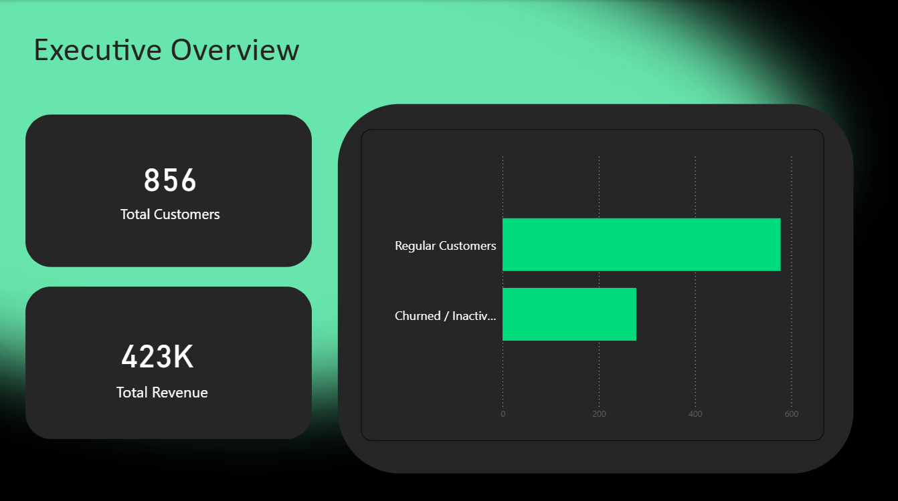
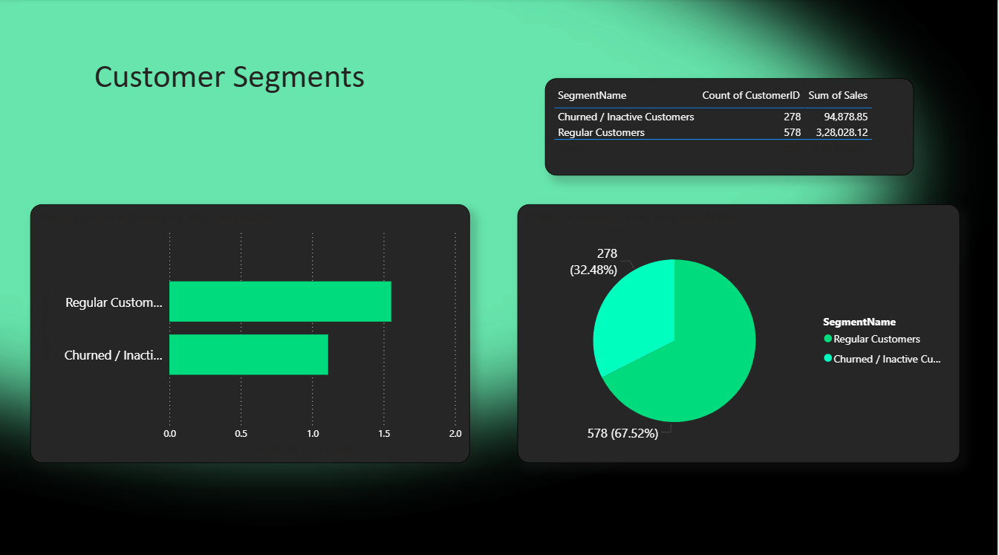
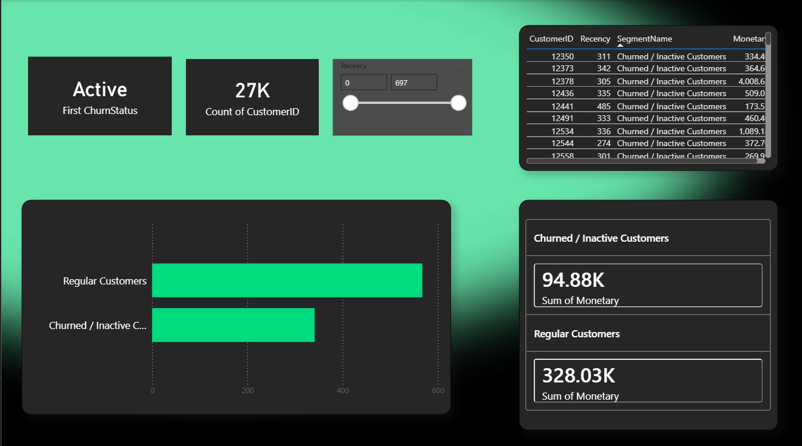
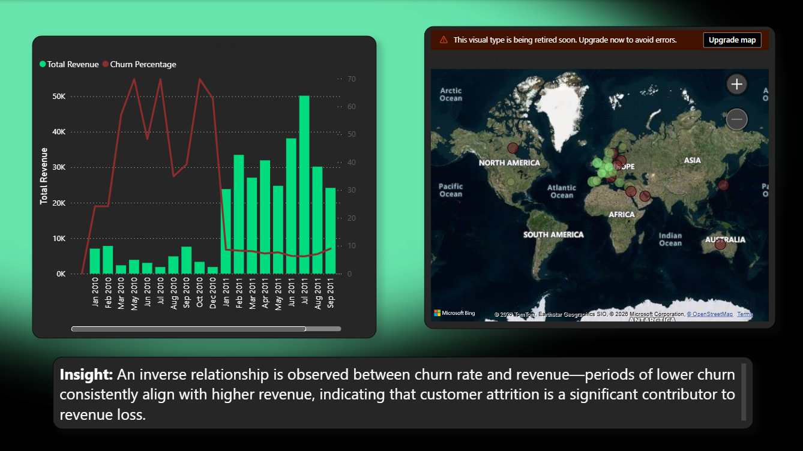
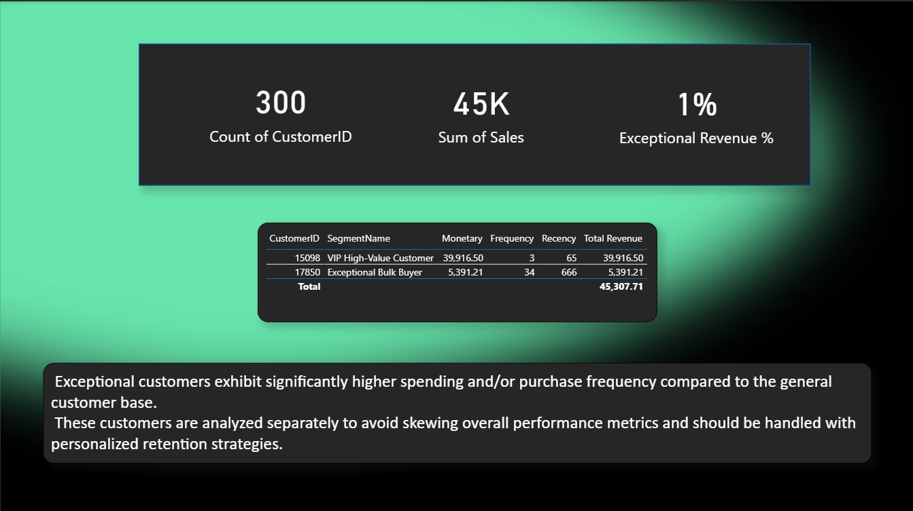

# Customer-Segmentation-and-churn-analysis
## 1. Problem Statement
Businesses often struggle to identify high-value customers and detect churn early. This project segments customers based on purchasing behavior and analyzes churn trends to support retention strategies.
## 2. Tech Stack
Python | Pandas | Scikit-learn | Power BI | SQL
## 3. Methodology
* Data cleaning and preprocessing of retail transaction data
* RFM feature engineering (Recency, Frequency, Monetary)
* K-Means clustering for customer segmentation
* Churn definition based on customer inactivity (>90 days of inactivity)
* Interactive Power BI dashboards for business insights
## 4. Dashboard Preview

## 5. Key Insights
* Lower churn rates consistently align with higher revenue
* Inactive customer segments exhibit significantly higher churn risk
* Exceptional customers contribute disproportionately to revenue
## 6. How to Run
* Open notebook
* Open PBIX locally
## 7. Notebook
